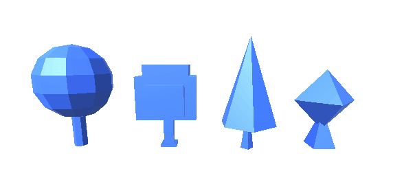

# Unity Mesh Triangulator

Explode into triangles any mesh you want!



### Prerequisites

The given project was made with Unity 2018.2.3f1

### Installing

You can open the entire project with Unity or just get the package and throw it at any project

## Running the tests

The example project has a different structure which call the static MeshTriangulator script. 
If you want to test it with any other objects with meshes just try to call the Triangulate() function and give it the object transform 

```
MeshTriangulator.Triangulate(transform)
```

## License

This project is licensed under the MIT License - see the [LICENSE.md](LICENSE.md) file for details
